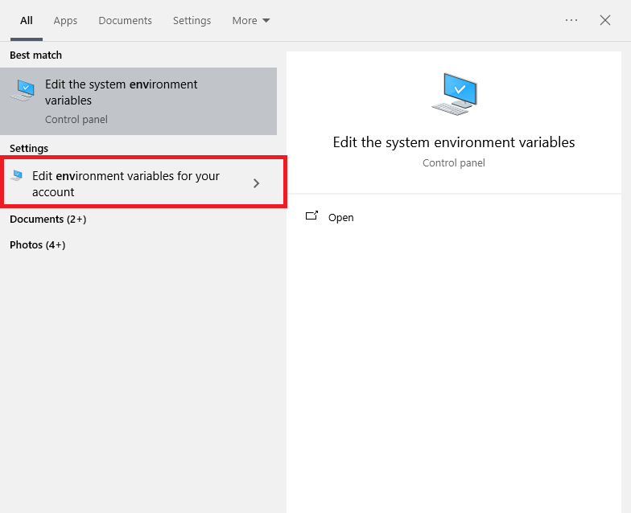

# LlamaCpp Install Procedure in Windows

 

## Introduction
I was trying to install Llama.CPP directly on my system to run my LLM server there. Before, trying this, I had considered the following:  

1. Tried using ollama, but the server is constrained on the types of roles you can use. They only allow 'system', 'user' and 'tool' roles. However, fine-tuned models like NousResearch's [Theta](https://huggingface.co/NousResearch/Hermes-2-Theta-Llama-3-8B) and [Pro](https://huggingface.co/NousResearch/Hermes-2-Pro-Llama-3-8B) are fine-tuned specifically for [function calling using a new role "tool".](https://huggingface.co/NousResearch/Hermes-2-Theta-Llama-3-8B#prompt-format-for-function-calling) Hence, a lot of wrangling and manipulating the user instructions were required that increased my tokens per query. I couldn't get a solution for this even on their Discord server.
   On a side note, though, if the functionality of Ollama is enough for you, it is a brilliant inference server and I can't stop recommending it.  
3. I tried using llama-cpp-server. Pretty brilliant again, but there were some <a href="https://github.com/abetlen/llama-cpp-python/issues/148">issues about it being slower than the bare-bones Llama.cpp</a>. Since, I am GPU-poor and wanted to maximize my inference speed, I decided to install [Llama.cpp](https://github.com/ggerganov/llama.cpp) on my Windows laptop.    <b>Oh boy!</b>
  
## Issues and attempts:
* I struggled with this installation a lot, traversing nvidia groups due to CUDA errors, VS forums, because it wasn't detecting the CUDA installation and downloading, editing, screwing up and redownloading the Llama.cpp repo.
* I also saw a lot of posts that were asking for solution for errors that were similar to the ones that I saw (and there were a lot!).
* I installed and re-installed the CMake library and the Windows SDK repeatedly to see if those libraries were creating issues.
* I even tried editing with the MAKE file as shown <a href="https://github.com/ggerganov/llama.cpp/issues/4409"> here</a>, but to no avail. Honestly, I am not a C++ guy so I had no idea what I was doing.  
 

## Solution:
I finally found the key to my solution <a href="https://forums.developer.nvidia.com/t/cudacompile-nvcc-error-cudafe-died-with-status-0xc0000409/260651/15">here </a>. More specifically, in the screenshot below:

 

Basically, the only Community version of Visual Studio that was available to download from Microsoft was incompatible even with the latest version of cuda (As of writing this post, the latest version of Nvidia is CUDA 12.5). Hence, all my errors were fundamentally derived from there. Hence, I wrote down this post just to explain in detail, all the steps I took to ensure a smooth installation and running of the Llama.CPP server. 

## Steps (All the way from the basics):
To be fair, the [README file](https://github.com/ggerganov/llama.cpp?tab=readme-ov-file#usage) is pretty well written and the steps are easy to follow. The problems are with getting CUDA and the C++ Desktop environment of VS to talk to each other.

1. Download and install CUDA from here: [Cuda Toolkit 12.5 downloads](https://developer.nvidia.com/cuda-downloads) . If you are worried about Pytorch compatibility, currently [CUDA 12.1](https://developer.nvidia.com/cuda-12-1-1-download-archive) is supported by Pytorch.
2. Download and install Visual C++ as follows:
    * Download the Visual Studio 2109 software from <b>[here]()</b> Unless you have a Professional or an Enterprise license, Microsoft does not give you access to Visual Studio 2019 software.
      <TO BE COMPLETED>
3. Set the environment variables (Ensure your Windows account has administrative rights to perform these functions)
    * Click on the Start icon on the bottom left and type: environment
    * Click on "edit environment variables for your account
        
    * In the system variables section in the pop up window, click on "New"
    * Set the variable name as "CMAKE_ARGS" and the Variable value as "-DLLAMA_CUBLAS=on -DLLAMA_BLAS_VENDOR=OpenBLAS" as shown below and click "OK":  
        
    * Similarly, create a second system variable. Set the variable name as CUDA_PATH. The Variable value should be the path to your CUDA library. Examples as below:  
        
    * Create a third system variable. Set the variable name as LLAMA_CUDA and its value to "on" as shown below and click "OK":  
        
